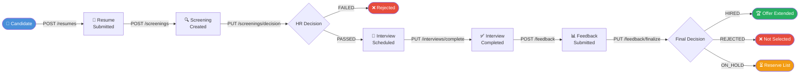
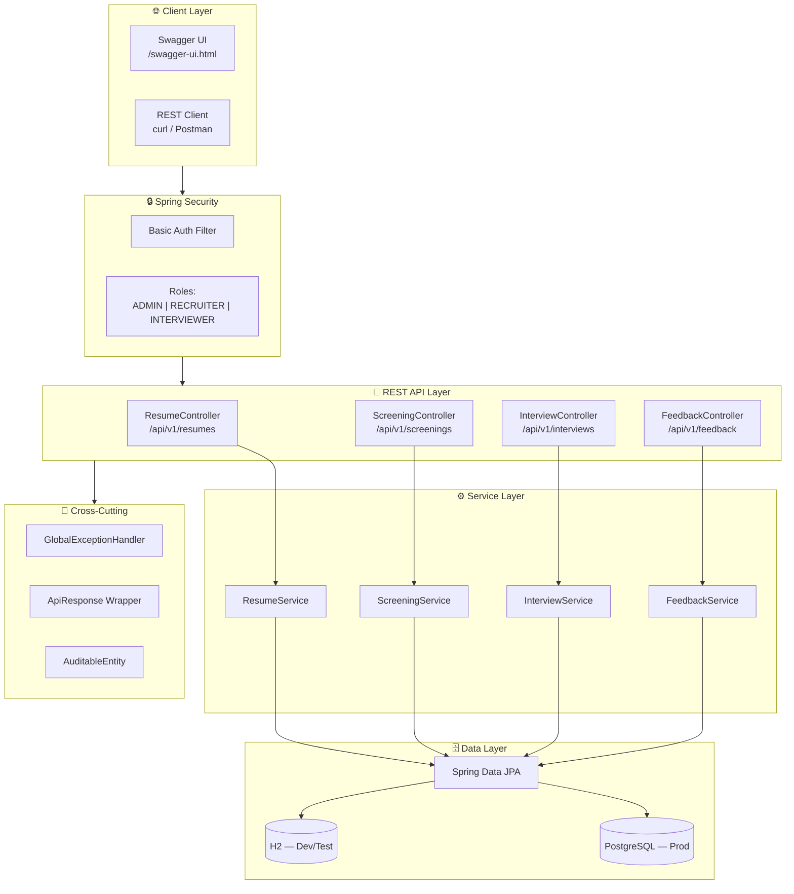
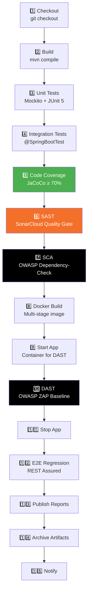

# 🇪🇺 EC Interview Management System
### European External Action Service — DevSecOps Showcase

<p align="center">
  
  
  
  
  
  
  
  
</p>

---

> **A production-grade Spring Boot REST API** simulating the European External Action Service's end-to-end candidate interview lifecycle, wrapped in a full **DevSecOps Jenkins pipeline** covering SAST, DAST, and SCA — built to demonstrate real-world Java engineering and security engineering skills.

---

## 📋 Table of Contents

- [Overview](#-overview)
- [Interview Lifecycle Pipeline](#-interview-lifecycle-pipeline)
- [Architecture](#-architecture)
- [API Modules](#-api-modules)
- [Technology Stack](#-technology-stack)
- [DevSecOps Pipeline](#-devsecops-pipeline)
- [Test Strategy](#-test-strategy)
- [Project Structure](#-project-structure)
- [Quick Start](#-quick-start)
- [Running Tests](#-running-tests)
- [Docker](#-docker)
- [Jenkins Setup](#-jenkins-setup)
- [SonarCloud Setup](#-sonarcloud-setup)
- [API Reference](#-api-reference)
- [Security](#-security)

---

## 🎯 Overview

This project models the **European External Action Service's digital recruitment process** across four distinct modules:

| Module | Responsibility | Status Flow |
|--------|---------------|-------------|
| 📄 **Resume Submission** | Candidate registration & CV upload | `DRAFT` → `SUBMITTED` → `UNDER_REVIEW` |
| 🔍 **Screening** | HR eligibility assessment | `PENDING` → `PASSED` / `FAILED` |
| 🎤 **Technical Interview** | Schedule & manage interviews | `SCHEDULED` → `COMPLETED` / `CANCELLED` |
| 📊 **Feedback & Decision** | Post-interview scoring & final verdict | Draft → `HIRED` / `REJECTED` / `ON_HOLD` |

---

## 🔄 Interview Lifecycle Pipeline



---

## 🏗️ Architecture



---

## 📦 API Modules

### 📄 Resume Submission — `/api/v1/resumes`

| Method | Endpoint | Role | Description |
|--------|----------|------|-------------|
| `POST` | `/` | RECRUITER, ADMIN | Submit a new resume (creates candidate if new) |
| `GET` | `/{id}` | RECRUITER, ADMIN | Get resume by ID |
| `GET` | `/` | RECRUITER, ADMIN | List all resumes (paginated, filterable by status) |
| `PUT` | `/{id}/status` | RECRUITER, ADMIN | Update resume status |
| `DELETE` | `/{id}` | RECRUITER, ADMIN | Withdraw a resume |
| `GET` | `/candidate/{id}` | RECRUITER, ADMIN | All resumes for a candidate |

### 🔍 Screening — `/api/v1/screenings`

| Method | Endpoint | Role | Description |
|--------|----------|------|-------------|
| `POST` | `/` | RECRUITER, ADMIN | Create screening for a SUBMITTED resume |
| `GET` | `/{id}` | RECRUITER, ADMIN | Get screening by ID |
| `GET` | `/resume/{resumeId}` | RECRUITER, ADMIN | Get screening by resume |
| `GET` | `/pending` | RECRUITER, ADMIN | List all PENDING screenings |
| `PUT` | `/{id}/decision` | RECRUITER, ADMIN | Record PASSED / FAILED decision |

### 🎤 Technical Interview — `/api/v1/interviews`

| Method | Endpoint | Role | Description |
|--------|----------|------|-------------|
| `POST` | `/` | INTERVIEWER, ADMIN | Schedule interview (only for PASSED screenings) |
| `GET` | `/{id}` | INTERVIEWER, ADMIN | Get interview by ID |
| `GET` | `/upcoming` | INTERVIEWER, ADMIN | Interviews in next 30 days |
| `GET` | `/` | INTERVIEWER, ADMIN | Filter by status |
| `PUT` | `/{id}/reschedule` | INTERVIEWER, ADMIN | Reschedule interview |
| `PUT` | `/{id}/complete` | INTERVIEWER, ADMIN | Mark as COMPLETED |
| `PUT` | `/{id}/cancel` | INTERVIEWER, ADMIN | Cancel with reason |

### 📊 Feedback & Decision — `/api/v1/feedback`

| Method | Endpoint | Role | Description |
|--------|----------|------|-------------|
| `POST` | `/` | INTERVIEWER, ADMIN | Submit feedback (only for COMPLETED interviews) |
| `GET` | `/{id}` | INTERVIEWER, ADMIN | Get feedback by ID |
| `GET` | `/interview/{id}` | INTERVIEWER, ADMIN | Get feedback by interview |
| `GET` | `/candidate/{id}/summary` | ADMIN | Full candidate feedback history |
| `GET` | `/pending` | INTERVIEWER, ADMIN | Unfinalized feedbacks |
| `PUT` | `/{id}/finalize` | INTERVIEWER, ADMIN | Final HIRED / REJECTED / ON_HOLD decision |

---

## 🛠️ Technology Stack

| Category | Technology |
|----------|-----------|
| **Language** | Java 19 |
| **Framework** | Spring Boot 3.2.5 |
| **Build** | Apache Maven 3.9 |
| **Security** | Spring Security — HTTP Basic Auth |
| **Persistence** | Spring Data JPA + Hibernate |
| **Database (Dev/Test)** | H2 In-Memory |
| **Database (Prod)** | PostgreSQL 16 |
| **API Documentation** | SpringDoc OpenAPI 3 (Swagger UI) |
| **Code Quality** | Lombok, Bean Validation (Jakarta) |
| **Unit Testing** | JUnit 5 + Mockito |
| **Integration Testing** | Spring Boot Test + MockMvc |
| **E2E / Regression** | REST Assured |
| **Code Coverage** | JaCoCo (≥ 70% line, ≥ 50% branch) |
| **SAST** | SonarCloud |
| **SCA** | OWASP Dependency-Check |
| **DAST** | OWASP ZAP (baseline scan) |
| **CI/CD** | Jenkins (Declarative Pipeline) |
| **Containerisation** | Docker (multi-stage) + Docker Compose |

---

## 🔐 DevSecOps Pipeline



### Pipeline Report Outputs

| Report | Location | Tool |
|--------|----------|------|
| Unit Test Results | `target/surefire-reports/` | Maven Surefire |
| Integration Test Results | `target/failsafe-reports/` | Maven Failsafe |
| Code Coverage HTML | `target/site/jacoco/index.html` | JaCoCo |
| SAST Dashboard | [sonarcloud.io](https://sonarcloud.io) | SonarCloud |
| SCA Report HTML | `target/dependency-check-report/` | OWASP Dep-Check |
| DAST Report HTML | `zap/reports/zap-report.html` | OWASP ZAP |

---

## 🧪 Test Strategy

```
52 Tests — 0 Failures
├── Unit Tests (26) — Mockito + JUnit 5
│   ├── ResumeServiceTest     (12 tests — 5 nested groups)
│   ├── ScreeningServiceTest  ( 8 tests — 4 nested groups)
│   ├── InterviewServiceTest  ( 8 tests — 4 nested groups)
│   └── FeedbackServiceTest   ( 8 tests — 3 nested groups)
│
├── Integration Tests (7) — @SpringBootTest + MockMvc
│   └── ResumeControllerIT    ( 7 tests — auth, validation, 404, 409, pagination)
│
└── E2E Regression Tests (19) — REST Assured @TestMethodOrder
    └── InterviewLifecycleE2ETest
        ├── Step 1: Submit Resume          (happy path + duplicate check)
        ├── Step 2: Create Screening       (happy path + duplicate check)
        ├── Step 3: Record PASSED Decision (happy path + already-decided guard)
        ├── Step 4: Schedule Interview     (happy path + details verification)
        ├── Step 5: Complete Interview     (happy path + idempotency guard)
        ├── Step 6: Submit Feedback        (happy path + 404 negative path)
        ├── Step 7: Finalize HIRED         (happy path + re-finalize guard + summary)
        └── Infrastructure: Swagger UI + Actuator health checks
```

> **Coverage Gates (enforced by JaCoCo):**  ≥ 70% line coverage · ≥ 50% branch coverage

---

## 📁 Project Structure

```
eeas-interview-management-system/
│
├── 📄 pom.xml                         # Maven — all deps & plugin config
├── 🐳 Dockerfile                      # Multi-stage build (JRE 19 runtime)
├── 🐳 docker-compose.yml              # App + PostgreSQL + Adminer UI
├── 🔧 Jenkinsfile                     # 15-stage declarative pipeline
├── 🔍 sonar-project.properties        # SonarCloud SAST configuration
├── 🛡️ dependency-check-suppression.xml # OWASP false-positive suppressions
├── 🛡️ zap/zap-baseline.conf           # OWASP ZAP DAST rule thresholds
│
└── src/
    ├── main/
    │   ├── java/eu/commission/ims/
    │   │   ├── InterviewManagementApplication.java
    │   │   ├── config/
    │   │   │   ├── SecurityConfig.java       # Basic Auth, role-based access
    │   │   │   ├── OpenApiConfig.java        # Swagger / OpenAPI 3
    │   │   │   └── DataInitializer.java      # Seed data (dev/test only)
    │   │   ├── common/
    │   │   │   ├── audit/AuditableEntity.java
    │   │   │   ├── dto/ApiResponse.java       # Universal response envelope
    │   │   │   └── exception/               # ResourceNotFoundException,
    │   │   │                                #   BusinessException,
    │   │   │                                #   GlobalExceptionHandler
    │   │   └── module/
    │   │       ├── resume/                  # entity, repository, dto,
    │   │       ├── screening/               #   service, controller
    │   │       ├── interview/               # (per module)
    │   │       └── feedback/
    │   └── resources/
    │       ├── application.yml              # Base config
    │       ├── application-dev.yml          # H2 in-memory
    │       └── application-prod.yml.template # PostgreSQL template
    └── test/
        ├── java/eu/commission/ims/
        │   ├── unit/                        # Mockito + JUnit 5 service tests
        │   ├── integration/                 # @SpringBootTest controller tests
        │   └── e2e/                         # REST Assured regression suite
        └── resources/
            └── application-test.yml         # Isolated H2 test database
```

---

## 🚀 Quick Start

### Prerequisites

| Tool | Minimum Version |
|------|----------------|
| Java (JDK) | 19 |
| Maven | 3.9 |
| Docker | 24+ (optional, for prod stack) |

### Run Locally (Dev mode — H2 in-memory)

```bash
# Clone the repository
git clone https://github.com/puratchidasan/eeas-interview-management-system.git
cd eeas-interview-management-system

# Run the application
mvn spring-boot:run

# Application starts at:
#   API:        http://localhost:8090/api/v1/
#   Swagger UI: http://localhost:8090/swagger-ui.html
#   H2 Console: http://localhost:8090/h2-console
#   Health:     http://localhost:8090/actuator/health
```

### Default Credentials

| Username | Password | Roles |
|----------|----------|-------|
| `admin` | `admin123` | ADMIN (full access) |
| `recruiter` | `rec123` | RECRUITER (resumes + screenings) |
| `interviewer` | `int123` | INTERVIEWER (interviews + feedback) |

---

## 🧪 Running Tests

```bash
# Unit Tests only (fast — no Spring context)
mvn test "-Dspring.profiles.active=test"

# Unit + Integration Tests + Coverage Report
mvn verify "-Dspring.profiles.active=test"

# E2E Regression Tests only
mvn verify "-Dspring.profiles.active=test" -P regression

# View coverage report
# Open: target/site/jacoco/index.html
```

### Expected Output

```
Tests run: 26, Failures: 0, Errors: 0 (Unit)
Tests run:  7, Failures: 0, Errors: 0 (Integration)
Tests run: 19, Failures: 0, Errors: 0 (E2E Regression)
─────────────────────────────────────────────────────
Total:      52, Failures: 0, Errors: 0 ✅

[INFO] All coverage checks have been met. ✅
[INFO] BUILD SUCCESS
```

---

## 🐳 Docker

### Run with Docker Compose (App + PostgreSQL + Adminer)

```bash
# Build and start full stack
docker compose up -d

# Services:
#   App:     http://localhost:8090/swagger-ui.html
#   Adminer: http://localhost:8090  (Server: ims-db, User: ims_user, Pass: ims_pass)

# View logs
docker compose logs -f ims-app

# Stop
docker compose down
```

### Build image manually

```bash
# Package JAR
mvn package -DskipTests

# Build Docker image
docker build -t eeas-ims:latest .

# Run container
docker run -d -p 8090:8090 \
  -e SPRING_PROFILES_ACTIVE=dev \
  eeas-ims:latest
```

---

## 🔧 Jenkins Setup

### Prerequisites

Install these Jenkins plugins:
- **SonarQube Scanner**
- **OWASP Dependency-Check**
- **JaCoCo**
- **HTML Publisher**
- **Docker Pipeline**

### Configuration Steps

**1. Configure SonarCloud server in Jenkins**
```
Manage Jenkins → Configure System → SonarQube servers
  Name: SonarCloud
  URL:  https://sonarcloud.io
  Token: (add as secret text credential)
```

**2. Add credentials**
```
Manage Jenkins → Credentials → Add:
  ID: sonarcloud-token   → SonarCloud token (Secret Text)
  ID: docker-registry-creds → Docker Hub credentials (Username/Password)
```

**3. Configure tools**
```
Manage Jenkins → Global Tool Configuration:
  JDK:   Name = JDK-21,   JAVA_HOME = <path to JDK>
  Maven: Name = Maven-3.9, MAVEN_HOME = <path to Maven>
```

**4. Create Pipeline job**
```
New Item → Pipeline
  Definition: Pipeline script from SCM
  SCM: Git
  Repository URL: https://github.com/puratchidasan/eeas-interview-management-system
  Script Path: Jenkinsfile
```

**5. Run the pipeline** — Jenkins will automatically execute all 15 stages.

---

## ☁️ SonarCloud Setup

1. Go to [sonarcloud.io](https://sonarcloud.io) → **Log in with GitHub**
2. Click **+ → Analyze new project** → Select your repository
3. Note your **Organization key** and **Project key**
4. Update `sonar-project.properties`:
   ```properties
   sonar.projectKey=YOUR_PROJECT_KEY
   sonar.organization=YOUR_ORG_KEY
   ```
5. Generate a token: **My Account → Security → Generate Token**
6. Add token to Jenkins credentials as `sonarcloud-token`

Run SAST manually:
```bash
mvn sonar:sonar "-Dsonar.login=YOUR_TOKEN"
```

---

## 🔐 Security

### Authentication Model
- **HTTP Basic Authentication** — stateless, suitable for REST API
- **BCrypt** password encoding
- **Role-based access control** enforced at controller level

### Business Rule Enforcement
- ❌ Cannot screen a DRAFT resume
- ❌ Cannot schedule interview without PASSED screening
- ❌ Cannot submit feedback for a non-COMPLETED interview
- ❌ Cannot finalize feedback twice
- ❌ Cannot complete a CANCELLED interview
- ❌ Duplicate resume submissions blocked per candidate

### DevSecOps Security Gates
| Gate | Threshold | Action on Breach |
|------|-----------|-----------------|
| SonarCloud Quality Gate | Must pass | Pipeline → UNSTABLE |
| OWASP Dep-Check CVSS | ≥ 7.0 (High) | Pipeline reports violation |
| OWASP ZAP DAST | Critical rules defined | Pipeline → FAIL |
| JaCoCo Line Coverage | ≥ 70% | Pipeline → FAIL |
| JaCoCo Branch Coverage | ≥ 50% | Pipeline → FAIL |

---

## 🤝 Contributing

This project follows **conventional commits**:

```
feat:     New feature
fix:      Bug fix
test:     Adding tests
refactor: Code refactoring
docs:     Documentation
ci:       Jenkins/pipeline changes
security: Security-related changes
```

---

## 📄 Licence

European Union Public Licence v1.2 — [EUPL-1.2](https://joinup.ec.europa.eu/collection/eupl/eupl-text-eupl-12)

---

<p align="center">
  Built as a <strong>DevSecOps skills showcase</strong> · Spring Boot · Jenkins · SonarCloud · OWASP ZAP · OWASP Dependency-Check
</p>
